# :triangular_flag_on_post: ZenML Model Retraining TEMPLATE :triangular_flag_on_post:

## :page_with_curl: Description

The main idea of this project is to create a templated <b>Model Retraining</b> pipeline.
<br>

* Pipeline can be used with different ML Frameworks
* [ZenML framework](https://zenml.io/home) was used to create a template pipeline. Framework
  allows to develop platform-agnostic pipelines
* [MLFlow](https://zenml.io/home) was used as a Model Registry to version control models and its meta
* Pipeline schema:

```mermaid
flowchart LR

%% Flow definitions
data_loading([Data<br>Loading])
data_preprocessing([Data<br>Preprocessing])
data_splitting([Data<br>Splitting])
data_oversampling([Data<br>Oversampling])
model_training([Model<br>Training])
model_infering_new([Model<br>Infering])
model_evaluation_new([Model<br>Evaluation])
model_infering_curr([Model<br>Infering])
model_evaluation_curr([Model<br>Evaluation])
metrics_logging([Metrics<br>Logging])
model_loading([Model<br>Loading<br>Current])
model_rotation([Model<br>Rotation])

%% Data definitions
DB[(Data<br>Base)]

%% Server definitions
mlflow1(MLflow<br>Server)
mlflow2(MLflow<br>Server)


%% Flow relationships
subgraph NEW STAGING model
data_loading -- Raw<br/>data --> data_preprocessing
data_preprocessing -- Proceesed<br/>data --> data_splitting
data_splitting -- Train<br/>data --> data_oversampling
data_oversampling -- Oversampled<br/>data --> model_training
model_training -- Model<br/>new --> model_infering_new
model_infering_new -- Predictions --> model_evaluation_new
model_evaluation_new -- Metics -->  metrics_logging 
end
subgraph CURRENT PROD model
model_loading -- Model<br/>current --> model_infering_curr
model_infering_curr -- Predictions --> model_evaluation_curr
end
%% model_evaluation_curr & model_evaluation_new -- Metics -->  model_rotation
model_evaluation_curr -- Metics -->  model_rotation
model_evaluation_new -- Metics -->  model_rotation

%% Data / Server relationships
DB -. Features .-> data_loading
mlflow1 -. Model<br/>current .-> model_loading
metrics_logging -. Metrics .-> mlflow2
model_rotation -. Updated<br/>stages .-> mlflow2
model_training -. Model<br/>new .-> mlflow2


%% Color definitions
    classDef step fill:#009EAC,stroke:#333,stroke-width:2px;
    classDef data fill:#223848,stroke:#3F5A6C;
    classDef artifact fill:#615E9C;
    classDef server fill:#E0446D;

%% Colors
    %% Steps
    class data_loading step;
    class data_preprocessing step;
    class data_oversampling step;
    class data_splitting step;
    class model_training step;
    class model_loading step;
    class model_infering_new step;
    class model_infering_curr step;
    class model_evaluation_new step;
    class model_evaluation_curr step;
    class metrics_logging step;
    class model_rotation step;

%% Data
    class DB data;

%% Artifacts
    class model_new artifact
    class model_current artifact
    class metrics_new artifact
    class metrics_current artifact

%% Server
    class mlflow1 server
    class mlflow2 server
```



## :play_or_pause_button: Run template locally

### :wrench: Setup environment

#### 1. Set Python environment

Project was tested on **_Python 3.9_**

#### 2. Install requirements

```bash
pip install -r requirements.txt
```

#### 3. Set environment variables

##### 3.1 Create a .env file ([example](example.env)):

```
# To download data
GOOGLE_APPLICATION_CREDENTIALS=<path-to-your-gcp-credentials>
GOOGLE_CLOUD_PROJECT=<gcp-project-id>

# To run zenml pipelines
## local zenml server URI: http://127.0.0.1:8237
ZENML_SERVER_URI=<URI>
ZENML_USERNAME=<YOUR USER NAME>
ZENML_PASSWORD=<YOUR PASSWORD>

# Setting up the python path
PYTHONPATH=.
```

##### 3.2 Set environment variables:

```bash
export $(grep -v '^#' .env | xargs)
```

#### 4 Run MLFLow server locally

##### 4.1 Create folder for mlflow meta:

```bash
mkdir mlflow_meta
```

##### 4.2 Run MLflow server

```bash
export MLFLOW_PATH=$(pwd)/mlflow_meta;
mlflow server \
    --backend-store-uri sqlite:///$MLFLOW_PATH/mlflow.db \
    --default-artifact-root $MLFLOW_PATH \
    --host 0.0.0.0 \
    --port 5001
```

#### 5 ZenML first run

**_(OPTIONAL)_** Clean current ZenML meta
```bash
zenml clean
```
##### 5.1 Init ZenML server
```bash
zenml init
```

##### 5.2 Register MLFlow as an experiment-tracker

```bash
export MLFLOW_PATH=$(pwd)/mlflow_meta;
zenml experiment-tracker register mlflow_tracker_local \
  --flavor=mlflow \
  --tracking_uri="sqlite:///$MLFLOW_PATH/mlflow.db"
```

##### 5.3 Register ZenML local "stack"

```bash
zenml stack register model_retrain_local\
    -a default\
    -o default\
    -e mlflow_tracker_local\
    --set
```

### :bullettrain_front: Run pipelines

#### 1 Generate fake dataset
Define variables in [**generate_data.py**](scripts/generate_data.py) and run:
```bash
python scripts/generate_data.py
```

#### 2 Update SQL query
[**get_data.sql**](project/queries/get_data.sql)

#### 3 Run pipeline
There is 2 types of pipelines that you can run:

* [**Train pipeline**](project/run_training.py) - trains a new model and sets this model to _**STAGING**_ state
  <br>
  in the Model Registry. Then you can manualy change model state to _**PRODUCTION**_

```bash
python project/run_training.py
```

* [**ReTrain pipeline**](project/run_retraining.py) - trains a new model and
  <br>
  compares it with the current _**PRODUCTION**_ model. If _**new**_ model is better than _**current**_
  <br>
  it rotates models. This pipeline presumes that _**PRODUCTION**_ model already exists in a Model Registry

```bash
python project/run_retraining.py
```

## :gear: Configuring your own pipeline

### 1. Update 2 configuration files:

#### 1.1 [Project config](project/project_config.yaml):

(Schema to follow [model config](project/models/config_base.py))

```yaml
query_file_download_data: "load_data.sql"
random_state: 42
oversampling_method: smoteenn
test_size: 0.33
target_metric: f1_score
metric_lower_better: False
```

#### 1.2 [Model config](project/model_config.yaml):

(Schema to follow [project config](project/utils/config_handler.py))

```yaml
version: "1"
name: model_name
description: "model description"
framework: xgboost
model_type: logistic_regression
features_numeric:
  - col_num_0
  - col_num_1
  - col_num_2
features_categorical:
  - col_cat_0
  - col_cat_1
  - col_cat_2
target: target_binary
hyper_parameters:
extra_parameters:
```

### 2 (OPTIONAL) Add a new model handler for a new model framework usage

#### 2.1 Define functions for:

* data preprocessing
* model training
* model inference
  <br>

##### Example:

<b>[sklearn_classifier](project/models/sklearn_classifier)</b>

* [\_\_init\_\_](project/models/sklearn_classifier/__init__.py)
* [preprocessing](project/models/sklearn_classifier/preprocess.py)
* [training](project/models/sklearn_classifier/train.py)
* [inference](project/models/sklearn_classifier/infer.py)

#### 2.2 Update model selector file: [model_selector.py](project/models/model_selector.py)

## TODO
1. [ ] Add zenml_config.yaml to configure steps and resources
2. [ ] Add model framework info to handle models differently ([there](project/steps/predictor.py))
2. [ ] Pass project [project_config.yaml](project/project_config.yaml) from run pipeline (like [model_config.yaml](project/project_config.yaml) in this file [run_retraining.py](project/run_retraining.py)) 
3. [ ] Add serving pipeline with Bentoml framework
4. [ ] Add feature definition pipeline with Feast framework


